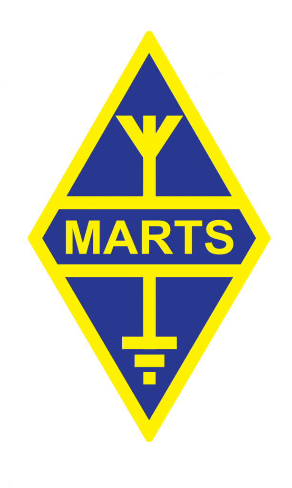

<div align="center">
  
  <h1>MARTS Membership Directory</h1>
  <p><strong>The Unofficial Modern Membership Database for 9M/9W Hams</strong></p>

  [](https://opensource.org/licenses/MIT)
  [](https://nextjs.org/)
  [](https://www.typescriptlang.org/)
  [](https://tailwindcss.com/)
  [](https://supabase.com/)
  [](https://vercel.com/)
  <br/>
  
</div>

<br />

## 🚀 Overview

A high-performance, responsive web application tailored for the Malaysian Amateur Radio Transmitters' Society (MARTS). Built to provide lightning-fast lookups, advanced filtering, and a beautiful futuristic interface.

> **Note**: This is an unofficial community project made for 🇲🇾 by [9M2PJU](https://hamradio.my).

## ✨ Features

- **⚡ Blazing Fast**: Powered by Next.js App Router and Supabase.
- **Performance**:
    - **Parallel Data Fetching**: 4x faster initial load.
    - **Debounced Search**: Instant responsiveness.
    - **Memoized Components**: Optimized rendering.
- **🔍 Advanced Search**: Instant callsign, name, or ID lookup.
- **📻 Smart Filters**:
    - **Class**: A, B, C, and **SWL** support.
    - **Region**: West Malaysia, Sabah, Sarawak.
    - **Status**: Live Active/Expired sorting.
- **📱 Mobile Optimized**: Fully responsive PWA-ready design.
- **🎨 Modern UI**: Glassmorphism aesthetics with "Space/Orbitron" theme.
- **🛡️ RBAC Admin**: Role-based access control for Admins and Super Admins.

## 🛠️ Tech Stack

| Component | Technology |
|-----------|------------|
| **Framework** | [Next.js 14](https://nextjs.org/) (App Router) |
| **Language** | [TypeScript](https://www.typescriptlang.org/) |
| **Styling** | [Tailwind CSS](https://tailwindcss.com/) + Lucide Icons |
| **Database** | [Supabase](https://supabase.com/) (PostgreSQL) |
| **Auth** | Supabase Auth |
| **Deployment** | [Vercel](https://vercel.com/) |

## 🚀 Getting Started

To get a local copy up and running, follow these steps.

### Prerequisites

- Node.js 18+ installed

### Installation

1. Clone the repo
   ```sh
   git clone https://github.com/9M2PJU/9M2PJU-MARTS-Membership.git
   ```
2. Install NPM packages
   ```sh
   npm install
   ```
3. Set up your `.env.local` file with Supabase credentials.

4. Run the development server
   ```sh
   npm run dev
   ```


## 📜 Callsign Structure

| Prefix | Region | Class |
|--------|--------|-------|
| **9M2** | West Malaysia | A |
| **9M6** | Sabah | A |
| **9M8** | Sarawak | A |
| **9W2** | West Malaysia | B |
| **9W6** | Sabah | B |
| **9W8** | Sarawak | B |
| **SWL** | West Malaysia | SWL |

## 📄 License

Distributed under the MIT License. See `LICENSE` for more information.

---
<div align="center">
  Made with ❤️ by 9M2PJU
</div>
